# Definição de Camadas e Classes – V1

# Diagrama de Classes – V1

```mermaid
classDiagram
    direction TB

    %% ─── MODEL ───────────────────────────────────────────
    class UserRole {
        <<enumeration>>
        ADMIN
        MANAGER
        INVESTOR
    }

    class RiskProfile {
        <<enumeration>>
        CONSERVATIVE
        MODERATE
        AGGRESSIVE
    }

    class User {
        +Long id
        +String name
        +String email
        +String passwordHash
        +UserRole role
        +String managerCode
        +boolean active
        +OffsetDateTime createdAt
        +boolean isAdmin()
        +boolean isManager()
        +boolean isInvestor()
        +boolean checkPassword(String)
    }

    class Investor {
        +Long id
        +String name
        +String documentId
        +RiskProfile riskProfile
        +Long responsibleManagerId
        +OffsetDateTime createdAt
    }

    class Asset {
        +Long id
        +String ticker
        +String name
        +String category
        +BigDecimal baseRisk
        +String getDisplayName()
    }

    class Portfolio {
        +Long id
        +Long investorId
        +String name
        +BigDecimal desiredRiskLevel
        +OffsetDateTime createdAt
        +List~PortfolioItem~ items
        +BigDecimal getTotalValue()
        +void addItem(PortfolioItem)
        +void removeItem(PortfolioItem)
    }

    class PortfolioItem {
        +Long id
        +Long portfolioId
        +Long assetId
        +BigDecimal quantity
        +BigDecimal averagePrice
        +BigDecimal suggestedPercentage
        +BigDecimal getPositionValue()
    }

    class Optimization {
        +Long id
        +Long portfolioId
        +Long runByUserId
        +BigDecimal expectedReturn
        +BigDecimal totalRisk
        +OffsetDateTime createdAt
    }

    class LogEntry {
        +Long id
        +Long userId
        +String action
        +String details
        +OffsetDateTime createdAt
    }

    %% ─── DAO ─────────────────────────────────────────────
    class SupabaseClient {
        +String projectUrl
        +String apiKey
        +HttpClient httpClient
        +JsonArray post(String, JsonObject)
        +JsonArray get(String)
        +void deleteById(String, Long)
        +JsonArray patch(String, JsonObject)
    }

    class UserDAO {
        +User create(User)
        +Optional~User~ findByEmail(String)
        +Optional~User~ findById(Long)
        +void update(User)
        +void delete(Long)
    }

    class InvestorDAO {
        +Investor create(Investor)
        +List~Investor~ findAll()
        +List~Investor~ findByManager(Long)
        +Optional~Investor~ findById(Long)
        +void delete(Long)
    }

    class AssetDAO {
        +Asset create(Asset)
        +List~Asset~ findAll()
        +Optional~Asset~ findByTicker(String)
    }

    class PortfolioDAO {
        +Portfolio create(Portfolio)
        +List~Portfolio~ findByInvestor(Long)
        +Optional~Portfolio~ findById(Long)
    }

    class PortfolioItemDAO {
        +PortfolioItem create(PortfolioItem)
        +List~PortfolioItem~ findByPortfolio(Long)
        +void updateSuggestedPercentage(Long, BigDecimal)
    }

    class OptimizationDAO {
        +Optimization create(Optimization)
        +List~Optimization~ findByPortfolio(Long)
    }

    class LogDAO {
        +LogEntry create(LogEntry)
        +List~LogEntry~ findRecentForUser(Long)
    }

    %% ─── SERVICE ─────────────────────────────────────────
    class AuthService {
        +UserDAO userDAO
        +LogDAO logDAO
        +User login(String, String)
    }

    class InvestorService {
        +InvestorDAO investorDAO
        +LogDAO logDAO
        +Investor createInvestor(Investor, User)
    }

    class PortfolioService {
        +PortfolioDAO portfolioDAO
        +PortfolioItemDAO portfolioItemDAO
        +LogDAO logDAO
        +Portfolio createPortfolio(Portfolio)
        +void addItem(PortfolioItem)
        +void removeItem(Long)
        +Portfolio loadPortfolioWithItems(Long)
    }

    class PortfolioOptimizerService {
        +PortfolioService portfolioService
        +OptimizationDAO optimizationDAO
        +Optimization optimizePortfolio(Long, User)
    }

    %% ─── CONTROLLER ──────────────────────────────────────
    class LoginController {
        +LoginView loginView
        +AuthService authService
        +void handleLogin()
    }

    class AdminUserController {
        +AdminUserView adminUserView
        +UserDAO userDAO
        +void loadUsers()
        +void openCreateUserForm()
        +void saveUser(UserFormDialog)
        +void deleteSelectedUser()
        +void logout()
    }

    class ManagerController {
        +ManagerMainView managerMainView
        +User loggedUser
        +InvestorController investorController
        +void openNewInvestorFlow()
        +void openInvestorHistory()
        +void logout()
    }

    class InvestorController {
        +InvestorService investorService
        +PortfolioService portfolioService
        +PortfolioOptimizerService optimizerService
        +User loggedUser
        +void registerAndOptimize()
        +void loadInvestorHistory(User)
        +void openSelectedInvestorDashboard()
        +void startNewInvestorRegistration()
        +void backToManagerMain()
        +void openInvestorHistory()
    }

    class PortfolioController {
        +PortfolioService portfolioService
        +PortfolioOptimizerService optimizerService
        +void loadPortfoliosForInvestor(Long)
        +void loadItemsForPortfolio(Long)
        +void savePortfolioItem(PortfolioItem)
        +void optimizePortfolio(Long, User)
    }

    %% ─── VIEW ────────────────────────────────────────────
    class LoginView {
        +void showView()
        +String getEmail()
        +String getPassword()
        +void showError(String)
        +void closeView()
    }

    class AdminUserView {
        +void showView()
        +void setController(AdminUserController)
        +void loadUsersTable(List~User~)
        +Long getSelectedUserId()
        +void showSuccess(String)
        +void showError(String)
        +boolean confirmDelete()
    }

    class UserFormDialog {
        +String getName()
        +String getEmail()
        +String getPassword()
        +UserRole getSelectedRole()
        +String getManagerCode()
        +boolean isActive()
        +void showError(String)
        +void closeDialog()
    }

    class ManagerMainView {
        +void showView()
        +void setLoggedUserName(String)
        +void showPanel(JPanel)
        +void showError(String)
    }

    class InvestorRegistrationOptimizationView {
        +String getInvestorName()
        +String getDocumentId()
        +RiskProfile getSelectedRiskProfile()
        +List~Asset~ getSelectedAssets()
        +void loadAssetsTable(List~Asset~)
        +void clearForm()
        +void showSuccess(String)
        +void showError(String)
    }

    class AssetSelectionPanel {
        +void loadAssets(List~Asset~)
        +List~Asset~ getSelectedAssets()
        +void clearSelection()
        +void selectAll()
    }

    class InvestorOptimizationDashboardView {
        +void setInvestorData(Investor)
        +void loadPortfolioItems(List~PortfolioItem~)
        +void setOptimizationSummary(Optimization)
        +void renderChart(List~PortfolioItem~)
        +void setReadOnlyMode(boolean)
        +void showError(String)
    }

    class ManagerInvestorHistoryView {
        +void loadInvestorsTable(List~Investor~)
        +Long getSelectedInvestorId()
        +void showError(String)
        +void showSuccess(String)
    }

    class InvestorReadOnlyDashboardView {
        +void setInvestorData(Investor)
        +void loadPortfolioItems(List~PortfolioItem~)
        +void setOptimizationSummary(Optimization)
        +void renderChart(List~PortfolioItem~)
        +void showError(String)
    }

    %% ─── RELAÇÕES MODEL ──────────────────────────────────
    User --> UserRole : role
    Investor --> RiskProfile : riskProfile
    Investor --> User : responsibleManagerId
    Portfolio --> Investor : investorId
    PortfolioItem --> Portfolio : portfolioId
    PortfolioItem --> Asset : assetId
    Optimization --> Portfolio : portfolioId
    Optimization --> User : runByUserId
    LogEntry --> User : userId

    %% ─── RELAÇÕES DAO ────────────────────────────────────
    UserDAO --> SupabaseClient : usa
    InvestorDAO --> SupabaseClient : usa
    AssetDAO --> SupabaseClient : usa
    PortfolioDAO --> SupabaseClient : usa
    PortfolioItemDAO --> SupabaseClient : usa
    OptimizationDAO --> SupabaseClient : usa
    LogDAO --> SupabaseClient : usa

    UserDAO --> User : mapeia
    InvestorDAO --> Investor : mapeia
    AssetDAO --> Asset : mapeia
    PortfolioDAO --> Portfolio : mapeia
    PortfolioItemDAO --> PortfolioItem : mapeia
    OptimizationDAO --> Optimization : mapeia
    LogDAO --> LogEntry : mapeia

    %% ─── RELAÇÕES SERVICE ────────────────────────────────
    AuthService --> UserDAO : usa
    AuthService --> LogDAO : usa
    InvestorService --> InvestorDAO : usa
    InvestorService --> LogDAO : usa
    PortfolioService --> PortfolioDAO : usa
    PortfolioService --> PortfolioItemDAO : usa
    PortfolioService --> LogDAO : usa
    PortfolioOptimizerService --> PortfolioService : usa
    PortfolioOptimizerService --> OptimizationDAO : usa

    %% ─── RELAÇÕES CONTROLLER ─────────────────────────────
    LoginController --> LoginView : gerencia
    LoginController --> AuthService : usa
    AdminUserController --> AdminUserView : gerencia
    AdminUserController --> UserDAO : usa
    ManagerController --> ManagerMainView : gerencia
    ManagerController --> InvestorController : delega
    InvestorController --> InvestorRegistrationOptimizationView : gerencia
    InvestorController --> ManagerInvestorHistoryView : gerencia
    InvestorController --> InvestorOptimizationDashboardView : gerencia
    InvestorController --> InvestorService : usa
    InvestorController --> PortfolioService : usa
    InvestorController --> PortfolioOptimizerService : usa
    PortfolioController --> InvestorOptimizationDashboardView : gerencia
    PortfolioController --> PortfolioService : usa
    PortfolioController --> PortfolioOptimizerService : usa

    %% ─── RELAÇÕES VIEW ───────────────────────────────────
    AdminUserView --> UserFormDialog : abre
    ManagerMainView --> InvestorRegistrationOptimizationView : exibe
    ManagerMainView --> ManagerInvestorHistoryView : exibe
    InvestorRegistrationOptimizationView --> AssetSelectionPanel : contém
    InvestorOptimizationDashboardView --|> InvestorReadOnlyDashboardView : reutilizável via setReadOnlyMode

```



## Visão geral das camadas

O sistema segue uma arquitetura em camadas baseada em **MVC + DAO + Service**:

- O usuário interage com a **View**, que dispara ações nos **Controllers**.
- Os **Controllers** criam/atualizam objetos do **Model** e chamam os **Services** quando há regra de negócio (ex.: autenticação, otimização).
- Os **Services** usam os **DAOs** para acessar o banco (via REST), persistindo e lendo dados que voltam como objetos do **Model**.

Camadas:

- **View** – telas Swing construídas no NetBeans (JFrame/JDialog/JPanel).
- **Controller** – coordena o fluxo entre interface, regras de negócio e persistência.
- **Service** – concentra regras de negócio e orquestra chamadas a vários DAOs.
- **DAO** – acesso a dados via requisições HTTP REST ao Supabase (usando `HttpClient` + Gson).
- **Model** – entidades de domínio, espelhando as tabelas do banco.

---

## 1. Camada Model (Domain)

Model concentra as classes de domínio, espelhando as tabelas do Supabase (PostgreSQL).
Cada classe é um POJO com atributos, construtores, getters/setters e, quando fizer sentido, pequenos métodos de domínio.

### 1.1 `User` ↔ tabela `users`

Representa um usuário interno (ADMIN, MANAGER ou INVESTOR), usado para autenticação e autorização.

**Atributos**

- `id : Long` – `users.id`. Identificador único, vindo do banco.
- `name : String` – `users.name`. Nome exibido em telas e logs.
- `email : String` – `users.email`. Usado como login (único).
- `passwordHash : String` – `users.password_hash`. Nunca armazena senha em texto plano.
- `role : UserRole` – enum para `users.role` (ADMIN, MANAGER, INVESTOR).
- `managerCode : String` – `users.manager_code`. Usado quando `role == MANAGER`.
- `active : boolean` – `users.active`. Define se o usuário pode logar.
- `createdAt : OffsetDateTime` – `users.created_at`. Data/hora de criação.

**Métodos principais**

- Getters/setters de todos os campos.
- `boolean isAdmin()` – retorna `role == UserRole.ADMIN`.
- `boolean isManager()` – retorna `role == UserRole.MANAGER`.
- `boolean isInvestor()` – retorna `role == UserRole.INVESTOR`.
- `boolean checkPassword(String plainPassword)` – compara `passwordHash` com a hash gerada localmente ou delega para backend.
- `String toString()` – algo como `"Nome (email)"`, útil em combos e logs.

---

### 1.2 `UserRole` (enum)

Enumeração de papéis de usuário, espelhando a constraint da coluna `users.role`.

**Valores**

- `ADMIN` – administrador, com acesso às telas de gestão de usuários.
- `MANAGER` – gerente, responsável pelas operações de portfólio.
- `INVESTOR` – investidor, com acesso somente leitura ao próprio portfólio otimizado.

---

### 1.3 `Investor` ↔ tabela `investors`

Representa o investidor atendido pelo gerente, usado para cadastro, histórico e otimização.

**Atributos**

- `id : Long` – `investors.id`.
- `name : String` – `investors.name`.
- `documentId : String` – `investors.document_id`.
- `riskProfile : RiskProfile` – `investors.risk_profile`.
- `responsibleManagerId : Long` – `investors.responsible_manager_id`, FK para `users.id`.
- `createdAt : OffsetDateTime` – `investors.created_at`.

**Métodos principais**

- Getters/setters.
- `String toString()` – `name (riskProfile)` ou `name (documentId)` para combos/tabelas.

---

### 1.4 `RiskProfile` (enum)

Enum alinhado à coluna `investors.risk_profile`.

**Valores**

- `CONSERVATIVE`
- `MODERATE`
- `AGGRESSIVE`

Usado tanto na lógica de otimização quanto na UI (combobox).

---

### 1.5 `Asset` ↔ tabela `assets`

Representa um ativo financeiro disponível para compor o portfólio.

**Atributos**

- `id : Long` – `assets.id`.
- `ticker : String` – `assets.ticker` (chave única, ex.: PETR4).
- `name : String` – `assets.name`.
- `category : String` – `assets.category` (ação, fundo etc.).
- `baseRisk : BigDecimal` – `assets.base_risk` (pode ser `null` na V1).

**Métodos principais**

- Getters/setters.
- `String getDisplayName()` – `"TICKER - Nome"` para exibir em listas.

---

### 1.6 `Portfolio` ↔ tabela `portfolios`

Representa a carteira de investimentos de um investidor.

**Atributos**

- `id : Long` – `portfolios.id`.
- `investorId : Long` – `portfolios.investor_id`.
- `name : String` – `portfolios.name`.
- `desiredRiskLevel : BigDecimal` – `portfolios.desired_risk_level` (opcional na V1).
- `createdAt : OffsetDateTime` – `portfolios.created_at`.
- `investor : Investor` – opcional, carregado via join.
- `items : List<PortfolioItem>` – itens da carteira, carregados via DAO.

**Métodos principais**

- Getters/setters.
- `BigDecimal getTotalValue()` – soma `quantity * averagePrice` de todos os itens se carregados.
- `void addItem(PortfolioItem item)` / `void removeItem(PortfolioItem item)` – manipulam a lista no lado cliente.

---

### 1.7 `PortfolioItem` ↔ tabela `portfolio_items`

Liga um `Portfolio` a um `Asset`, com quantidade, preço médio e percentual sugerido.

**Atributos**

- `id : Long` – `portfolio_items.id`.
- `portfolioId : Long` – `portfolio_items.portfolio_id`.
- `assetId : Long` – `portfolio_items.asset_id`.
- `quantity : BigDecimal` – `portfolio_items.quantity`.
- `averagePrice : BigDecimal` – `portfolio_items.average_price`.
- `suggestedPercentage : BigDecimal` – `portfolio_items.suggested_percentage`.
- `portfolio : Portfolio` – opcional.
- `asset : Asset` – opcional, carregado com join via Supabase REST.

**Métodos principais**

- Getters/setters.
- `BigDecimal getPositionValue()` – retorna `quantity * averagePrice`.

---

### 1.8 `Optimization` ↔ tabela `optimizations`

Representa uma execução do motor de otimização sobre um portfólio.

**Atributos**

- `id : Long` – `optimizations.id`.
- `portfolioId : Long` – `optimizations.portfolio_id`.
- `runByUserId : Long` – `optimizations.run_by_user_id`.
- `expectedReturn : BigDecimal` – `optimizations.expected_return`.
- `totalRisk : BigDecimal` – `optimizations.total_risk`.
- `createdAt : OffsetDateTime` – `optimizations.created_at`.

**Métodos principais**

- Getters/setters.

---

### 1.9 `LogEntry` ↔ tabela `logs`

Registro de log de ações importantes (login, criação, exclusão etc.).

**Atributos**

- `id : Long` – `logs.id`.
- `userId : Long` – `logs.user_id`.
- `action : String` – `logs.action`.
- `details : String` – `logs.details`.
- `createdAt : OffsetDateTime` – `logs.created_at`.

**Métodos principais**

- Getters/setters.
- `String toString()` – algo como `"createdAt - userId - action"` para debugging.

---

### 1.10 `PortfolioPrice` ↔ tabela `portfolio_prices`

Dados de preço por data e ticker, usados pelo motor de otimização (opcional na V1).

**Atributos**

- `date : LocalDate` – `portfolio_prices.date` (texto no banco convertido para `LocalDate`).
- `ticker : String` – `portfolio_prices.ticker`.
- `price : BigDecimal` – `portfolio_prices.price` (texto convertido para `BigDecimal`).

**Métodos principais**

- Getters/setters.

---

## 2. Camada DAO (acesso a dados)

Os DAOs isolam o acesso ao Supabase via HTTP REST, usando `HttpClient` + Gson (padrão do `TesteDB`).
Cada DAO recebe uma instância de `SupabaseClient`, monta o caminho da tabela e os filtros como query-string, e converte JSON em objetos do Model.

### 2.1 Classe base `SupabaseClient`

Encapsula URL do projeto, API key e os métodos HTTP genéricos reutilizados por todos os DAOs.

**Atributos**

- `protected String projectUrl` – URL base, ex.: `"https://<id>.supabase.co/rest/v1"`.
- `protected String apiKey` – chave de autenticação lida de variável de ambiente ou config.
- `protected HttpClient httpClient` – instância única reutilizada.

**Construtor**

```java
public SupabaseClient(String projectUrl, String apiKey) {
    this.projectUrl = projectUrl;
    this.apiKey = apiKey;
    this.httpClient = HttpClient.newHttpClient();
}
```

**Métodos utilitários**

- `protected JsonArray post(String tablePath, JsonObject body)` – envia POST com header `Prefer: return=representation` e retorna o `JsonArray` da resposta.
- `protected JsonArray get(String tablePathWithQuery)` – envia GET e retorna `JsonArray`.
- `protected void deleteById(String tablePath, Long id)` – envia DELETE com filtro `?id=eq.<id>`.
- `protected JsonArray patch(String tablePathWithFilter, JsonObject body)` – envia PATCH com filtro na URL.

Todos os métodos montam `HttpRequest` com headers `apikey`, `Authorization: Bearer`, `Content-Type: application/json` e tratam códigos de status, lançando `RuntimeException` em caso de falha.

---

### 2.2 `UserDAO`

**Responsabilidade**: CRUD de `User` e busca por e-mail (login).

**Atributos**

- `private final SupabaseClient client`

**Métodos principais**

- `User create(User user)` – POST em `/users` com `name, email, password_hash, role, active`; retorna o `User` com `id` preenchido.
- `Optional<User> findByEmail(String email)` – GET `/users?email=eq.<email>&select=*`.
- `Optional<User> findById(Long id)` – GET `/users?id=eq.<id>&select=*`.
- `void update(User user)` – PATCH `/users?id=eq.<id>` com campos alterados.
- `void delete(Long id)` – `deleteById("/users", id)`.
- `private User fromJson(JsonObject obj)` – mapeia `id, name, email, password_hash, role, manager_code, active, created_at`.

---

### 2.3 `InvestorDAO`

**Responsabilidade**: CRUD de investidores vinculados a gerentes.

**Métodos principais**

- `Investor create(Investor investor)` – POST em `/investors` com `name, document_id, risk_profile, responsible_manager_id`.
- `List<Investor> findAll()` – GET `/investors?select=*`.
- `List<Investor> findByManager(Long managerId)` – GET `/investors?responsible_manager_id=eq.<managerId>&select=*`.
- `Optional<Investor> findById(Long id)` – GET `/investors?id=eq.<id>&select=*`.
- `void delete(Long id)` – DELETE `/investors?id=eq.<id>`.

---

### 2.4 `AssetDAO`

**Métodos principais**

- `Asset create(Asset asset)` – POST `/assets` com `ticker, name, category, base_risk`.
- `List<Asset> findAll()` – GET `/assets?select=*`.
- `Optional<Asset> findByTicker(String ticker)` – GET `/assets?ticker=eq.<ticker>&select=*`.

---

### 2.5 `PortfolioDAO`

**Métodos principais**

- `Portfolio create(Portfolio portfolio)` – POST `/portfolios` com `investor_id, name, desired_risk_level`.
- `List<Portfolio> findByInvestor(Long investorId)` – GET `/portfolios?investor_id=eq.<id>&select=*`.
- `Optional<Portfolio> findById(Long id)` – GET `/portfolios?id=eq.<id>&select=*`.

---

### 2.6 `PortfolioItemDAO`

**Métodos principais**

- `PortfolioItem create(PortfolioItem item)` – POST `/portfolio_items` com `portfolio_id, asset_id, quantity, average_price, suggested_percentage`.
- `List<PortfolioItem> findByPortfolio(Long portfolioId)` – GET `/portfolio_items?portfolio_id=eq.<id>&select=*,assets!inner(ticker,name,category,base_risk)` para trazer dados do ativo junto.
- `void updateSuggestedPercentage(Long id, BigDecimal percentage)` – PATCH `/portfolio_items?id=eq.<id>` com `suggested_percentage`.

---

### 2.7 `OptimizationDAO`

**Métodos principais**

- `Optimization create(Optimization opt)` – POST `/optimizations` com `portfolio_id, run_by_user_id, expected_return, total_risk`.
- `List<Optimization> findByPortfolio(Long portfolioId)` – GET `/optimizations?portfolio_id=eq.<id>&select=*`.

---

### 2.8 `LogDAO`

**Métodos principais**

- `LogEntry create(LogEntry log)` – POST `/logs` com `user_id, action, details`.
- `List<LogEntry> findRecentForUser(Long userId)` – GET `/logs?user_id=eq.<id>&order=created_at.desc&limit=50`.

---

### 2.9 `PortfolioPriceDAO` (opcional / motor)

**Métodos principais**

- `void upsertPrice(PortfolioPrice price)` – POST/UPSERT em `/portfolio_prices` (chave composta `date, ticker`).
- `List<PortfolioPrice> findByTicker(String ticker)` – GET `/portfolio_prices?ticker=eq.<ticker>&select=*`.

---

## 3. Camada Service (regras de negócio)

A camada Service centraliza regras de negócio, mantendo Controllers finos e DAOs focados em persistência.

### 3.1 `AuthService`

**Responsabilidade**: autenticação de usuários internos.

**Dependências**

- `UserDAO userDAO`
- (Opcional) `LogDAO logDAO`

**Método principal**

- `User login(String email, String plainPassword)`
  - Busca o usuário por e-mail via `userDAO.findByEmail`.
  - Verifica se existe e se `active` é `true`.
  - Valida a senha via `User.checkPassword(plainPassword)`.
  - Em caso de sucesso, registra log de `LOGIN_SUCCESS` e retorna o `User`.
  - Em caso de falha, lança exceção de autenticação para o Controller tratar.

---

### 3.2 `InvestorService`

**Responsabilidade**: operações de investidor associadas a um gerente.

**Dependências**

- `InvestorDAO investorDAO`
- `LogDAO logDAO`

**Métodos**

- `Investor createInvestor(Investor investor, User currentUser)`
  - Valida que `currentUser.isManager()` é `true`.
  - Preenche `responsibleManagerId` com `currentUser.getId()`.
  - Chama `investorDAO.create(investor)`.
  - Cria e persiste um `LogEntry` descrevendo a criação.
  - Retorna o `Investor` com `id` preenchido.

- (Opcional) Métodos de listagem/remoção que encapsulam regras de permissão e logging.

---

### 3.3 `PortfolioService`

**Responsabilidade**: agrupar operações sobre carteiras.

**Dependências**

- `PortfolioDAO portfolioDAO`
- `PortfolioItemDAO portfolioItemDAO`
- `LogDAO logDAO`

**Métodos típicos**

- `Portfolio createPortfolio(Portfolio portfolio)` – cria carteira do investidor via DAO.
- `void addItem(PortfolioItem item)` – adiciona item via `portfolioItemDAO.create`.
- `void removeItem(Long portfolioItemId)` – deleta item via DAO e registra log.
- `Portfolio loadPortfolioWithItems(Long portfolioId)` – carrega carteira via `portfolioDAO.findById` e itens via `portfolioItemDAO.findByPortfolio`, retornando o `Portfolio` com a lista de itens preenchida.

---

### 3.4 `PortfolioOptimizerService`

**Responsabilidade**: implementar o motor de otimização simplificado.

**Dependências**

- `PortfolioService portfolioService`
- `PortfolioPriceDAO portfolioPriceDAO` (se usar preços históricos)
- `OptimizationDAO optimizationDAO`

**Método principal**

- `Optimization optimizePortfolio(Long portfolioId, User currentUser)`
  - Carrega carteira e itens via `portfolioService.loadPortfolioWithItems`.
  - Aplica regra simplificada de distribuição (por perfil de risco, categorias, pesos normalizados).
  - Atualiza `suggestedPercentage` de cada item via `portfolioItemDAO.updateSuggestedPercentage`.
  - Calcula `expectedReturn` e `totalRisk` (mesmo que simplificados).
  - Persiste e retorna o registro `Optimization` via `optimizationDAO.create`.

> **Nota:** o retorno do tipo `Optimization` (em vez de `void`) permite que o Controller repasse o resumo diretamente para a View após a otimização, sem segunda consulta ao banco.

---

## 4. Camada Controller

Controllers recebem eventos da UI, invocam Services/DAOs e devolvem resultados para a View. Cada Controller é instanciado com as dependências (Views e Services) injetadas pelo construtor.

### 4.1 `LoginController`

**Atributos**

- `LoginView loginView`
- `AuthService authService`

**Métodos**

- Construtor – injeta `loginView` e `authService`.
- `void handleLogin()`
  - Lê email/senha da `loginView`.
  - Chama `authService.login(email, password)`.
  - Se sucesso:
    - `role == ADMIN` → abre `AdminUserView` via `AdminUserController`.
    - `role == MANAGER` → abre `ManagerMainView` via `ManagerController`.
    - `role == INVESTOR` → abre `InvestorReadOnlyDashboardView` carregando o portfólio do investidor.
    - Fecha `loginView`.
  - Se falha, chama `loginView.showError(mensagem)`.

---

### 4.2 `AdminUserController`

**Responsabilidade**: gerenciar a jornada do Administrador (CRUD de usuários do sistema).

**Atributos**

- `AdminUserView adminUserView`
- `UserDAO userDAO`

**Métodos**

- Construtor – injeta `adminUserView` e `userDAO`.
- `void loadUsers()` – busca todos os usuários via `userDAO.findAll()` (se existir) ou múltiplos `findById`; chama `adminUserView.loadUsersTable(users)`.
- `void openCreateUserForm()` – instancia e exibe `UserFormDialog`; injeta a si mesmo como controller do dialog.
- `void saveUser(UserFormDialog dialog)` – lê dados do dialog, monta `User`, chama `userDAO.create(user)`; chama `dialog.closeDialog()` e recarrega a tabela.
- `void deleteSelectedUser()` – obtém id via `adminUserView.getSelectedUserId()`; chama `adminUserView.confirmDelete()`; se confirmado, chama `userDAO.delete(id)` e recarrega a tabela.
- `void logout()` – fecha `adminUserView` e retorna para `LoginView`.

---

### 4.3 `ManagerController`

**Responsabilidade**: gerenciar a navegação da jornada do Gerente a partir da `ManagerMainView`.

**Atributos**

- `ManagerMainView managerMainView`
- `User loggedUser`
- `InvestorController investorController`

**Métodos**

- Construtor – injeta `managerMainView`, `loggedUser` e `investorController`.
- `void openNewInvestorFlow()` – instancia ou reusa `InvestorRegistrationOptimizationView`; exibe no painel central da `managerMainView`.
- `void openInvestorHistory()` – instancia ou reusa `ManagerInvestorHistoryView`; chama `investorController.loadInvestorHistory(loggedUser)` e exibe no painel central.
- `void logout()` – fecha `managerMainView` e retorna para `LoginView`.

---

### 4.4 `InvestorController`

**Responsabilidade**: coordenar operações de investidor, portfólio, otimização e navegação entre as telas da jornada do Gerente.

**Atributos**

- `InvestorRegistrationOptimizationView registrationView`
- `ManagerInvestorHistoryView historyView`
- `InvestorOptimizationDashboardView dashboardView`
- `InvestorService investorService`
- `PortfolioService portfolioService`
- `PortfolioOptimizerService optimizerService`
- `AssetDAO assetDAO`
- `User loggedUser`

**Métodos principais**

- `void registerAndOptimize()`
  - Lê dados do investidor de `registrationView` (nome, documento, perfil de risco).
  - Lê ativos selecionados via `registrationView.getSelectedAssets()`.
  - Chama `investorService.createInvestor(investor, loggedUser)`.
  - Cria um `Portfolio` via `portfolioService.createPortfolio(...)`.
  - Para cada ativo selecionado, cria um `PortfolioItem` via `portfolioService.addItem(...)`.
  - Chama `optimizerService.optimizePortfolio(portfolio.getId(), loggedUser)`.
  - Exibe `dashboardView` com os resultados via `dashboardView.setInvestorData(...)`, `dashboardView.loadPortfolioItems(...)`, `dashboardView.setOptimizationSummary(...)`.
- `void loadInvestorHistory(User manager)` – busca investidores do gerente via `investorService` ou `InvestorDAO.findByManager`; chama `historyView.loadInvestorsTable(investors)`.
- `void openSelectedInvestorDashboard()` – obtém id via `historyView.getSelectedInvestorId()`; carrega portfólio e última otimização; exibe `dashboardView`.
- `void startNewInvestorRegistration()` – limpa `registrationView` via `registrationView.clearForm()` e a exibe.
- `void backToManagerMain()` – notifica `ManagerController` para exibir a tela inicial do gerente.
- `void openInvestorHistory()` – delega para `loadInvestorHistory(loggedUser)` e exibe `historyView`.

---

### 4.5 `PortfolioController`

**Responsabilidade**: operações adicionais sobre carteiras quando necessário fora do fluxo principal (ex.: edição de itens individualmente).

**Atributos**

- `InvestorOptimizationDashboardView dashboardView`
- `PortfolioService portfolioService`
- `PortfolioOptimizerService optimizerService`

**Métodos principais**

- `void loadPortfoliosForInvestor(Long investorId)` – preenche lista de carteiras.
- `void loadItemsForPortfolio(Long portfolioId)` – carrega itens para tabela.
- `void savePortfolioItem(PortfolioItem item)` – adiciona/atualiza item via service.
- `void optimizePortfolio(Long portfolioId, User currentUser)` – chama o service de otimização e depois recarrega itens na `dashboardView`.

---

### 4.6 `AssetController`

**Responsabilidade**: operações de tela relacionadas a ativos, usando `AssetDAO` diretamente.

> Na V1 pode ser simples, pois os ativos podem ser mockados ou carregados estaticamente. Caso haja tela de cadastro de ativos, este controller a gerencia.

---

## 5. Camada View – Telas Swing consolidadas

A View é a camada de apresentação construída em Java Swing (NetBeans).
Inclui as telas abaixo, organizadas em jornadas: Comum, Administrador, Gerente e Investidor.

**Regra geral**: a View **não** deve conter SQL, requisições HTTP, conversão de JSON, regras de autenticação, cálculo de otimização, cálculo de percentuais, criação de logs ou validações complexas de negócio. Essas responsabilidades pertencem a Controller, Service, DAO ou Model.

### 5.1 Organização de pacotes sugerida

```text
src/
└── view/
    ├── LoginView.java
    ├── admin/
    │   ├── AdminUserView.java
    │   └── UserFormDialog.java
    ├── manager/
    │   ├── ManagerMainView.java
    │   ├── InvestorRegistrationOptimizationView.java
    │   ├── AssetSelectionPanel.java
    │   ├── InvestorOptimizationDashboardView.java
    │   └── ManagerInvestorHistoryView.java
    ├── investor/
    │   └── InvestorReadOnlyDashboardView.java
    └── util/
        ├── MessageUtil.java
        └── BaseFrame.java
```

Se quiser ainda mais simples na V1, pode agrupar tudo em `view` sem subpacotes.

---

### 5.2 Telas comuns

#### 5.2.1 `LoginView`

Primeira tela do sistema.

**Responsabilidades**

- Permitir login de usuários internos (ADMIN, MANAGER, INVESTOR).
- Receber email e senha.
- Chamar `LoginController.handleLogin()`.
- Exibir mensagens de erro em caso de falha.
- O redirecionamento para a tela correta é responsabilidade do `LoginController`, não da View.

**Componentes principais**

- `JTextField txtEmail`
- `JPasswordField txtPassword`
- `JButton btnLogin`
- `JLabel lblTitulo`, `lblEmail`, `lblSenha`

**Métodos principais**

- `void showView()`
- `String getEmail()`
- `String getPassword()`
- `void showError(String message)`
- `void closeView()`

**Evento principal**

- `btnLogin.addActionListener(e -> controller.handleLogin());`

---

### 5.3 Jornada do Administrador

Administrador controla usuários do sistema; não manipula portfólios nem otimizações diretamente.

#### 5.3.1 `AdminUserView`

Tela principal do administrador.

**Responsabilidades**

- Exibir todos os usuários cadastrados no sistema.
- Permitir cadastro de novos usuários (abrindo `UserFormDialog`).
- Permitir exclusão de usuários.
- Atualizar lista de usuários.
- (Opcional) Separar visualmente usuários por perfil.

**Componentes principais**

- `JTable tblUsers`
- `JButton btnNovoUsuario`, `btnExcluirUsuario`, `btnAtualizar`, `btnSair`
- `JLabel lblTitulo`
- `JPanel pnlResumoUsuarios`

**Colunas sugeridas da tabela**

- ID, Nome, Email, Perfil, Código do gerente, Ativo, Data de criação.

**Métodos principais**

- `void showView()`
- `void setController(AdminUserController controller)`
- `void loadUsersTable(List<User> users)`
- `Long getSelectedUserId()`
- `void showSuccess(String message)`
- `void showError(String message)`
- `boolean confirmDelete()`

**Eventos principais**

- `btnNovoUsuario.addActionListener(e -> controller.openCreateUserForm());`
- `btnExcluirUsuario.addActionListener(e -> controller.deleteSelectedUser());`
- `btnAtualizar.addActionListener(e -> controller.loadUsers());`
- `btnSair.addActionListener(e -> controller.logout());`

---

#### 5.3.2 `UserFormDialog`

Janela modal para cadastro/edição simples de usuários.

**Responsabilidades**

- Receber dados de um novo usuário ou editar um existente.
- Permitir escolher o perfil (role) e status ativo/inativo.
- Enviar os dados para o controller salvar.

**Componentes principais**

- `JTextField txtName`, `txtEmail`, `txtManagerCode`
- `JPasswordField txtPassword`
- `JComboBox<UserRole> cmbRole`
- `JCheckBox chkActive`
- `JButton btnSalvar`, `btnCancelar`

**Métodos principais**

- `String getName()`
- `String getEmail()`
- `String getPassword()`
- `UserRole getSelectedRole()`
- `String getManagerCode()`
- `boolean isActive()`
- `void showError(String message)`
- `void closeDialog()`

**Eventos principais**

- `btnSalvar.addActionListener(e -> controller.saveUser(this));`
- `btnCancelar.addActionListener(e -> dispose());`

**Regras visuais**

- Se perfil selecionado for `MANAGER`, o campo de código do gerente fica visível/habilitado; caso contrário, oculto ou desabilitado.
- Validações de negócio ficam no `AdminUserController`, não na View.

---

### 5.4 Jornada do Gerente

Principal jornada operacional: cadastro de investidor, seleção de ativos, execução da otimização e visualização de resultados.

#### 5.4.1 `ManagerMainView`

Tela inicial do gerente após login.

**Responsabilidades**

- Centralizar a navegação da jornada do gerente.
- Dar acesso ao cadastro de novo investidor.
- Dar acesso ao histórico de investidores.
- Permitir saída/logout.

**Componentes principais**

- `JLabel lblTitulo`, `lblUserName`
- `JButton btnNovoInvestidor`, `btnHistoricoInvestidores`, `btnSair`
- `JPanel pnlContent` – painel central onde outros painéis são exibidos.

**Métodos principais**

- `void showView()`
- `void setLoggedUserName(String name)`
- `void showPanel(JPanel panel)`
- `void showError(String message)`

**Eventos principais**

- `btnNovoInvestidor.addActionListener(e -> controller.openNewInvestorFlow());`
- `btnHistoricoInvestidores.addActionListener(e -> controller.openInvestorHistory());`
- `btnSair.addActionListener(e -> controller.logout());`

---

#### 5.4.2 `InvestorRegistrationOptimizationView`

Tela principal de cadastro de investidor com seleção de ativos e disparo do fluxo de otimização.

**Responsabilidades**

- Cadastrar um novo investidor.
- Permitir selecionar os ativos desejados.
- Informar perfil/nível de risco.
- Executar o fluxo "Cadastrar e Otimizar" em um único botão.

**Componentes principais**

- `JTextField txtInvestorName`, `txtDocumentId`
- `JComboBox<RiskProfile> cmbRiskProfile`
- `JTable tblAssets`
- `JButton btnCadastrarEOtimizar`, `btnNovoUsuario`, `btnLimpar`, `btnVoltar`
- `JLabel lblTitulo`
- `JPanel pnlInvestorData`, `pnlAssetSelection`

**Campos do investidor**

- Nome, Documento, Perfil de risco (Conservador, Moderado, Agressivo).

**Tabela de ativos**

- Colunas: Selecionar (checkbox), Ticker, Nome do ativo, Categoria, Risco base.
- Na V1, ativos podem ser mockados (lista fixa de ~8 ativos).

**Métodos principais**

- `String getInvestorName()`
- `String getDocumentId()`
- `RiskProfile getSelectedRiskProfile()`
- `List<Asset> getSelectedAssets()`
- `void loadAssetsTable(List<Asset> assets)`
- `void clearForm()`
- `void showSuccess(String message)`
- `void showError(String message)`

**Eventos principais**

- `btnCadastrarEOtimizar.addActionListener(e -> controller.registerAndOptimize());`
- `btnNovoUsuario.addActionListener(e -> controller.startNewInvestorRegistration());`
- `btnLimpar.addActionListener(e -> clearForm());`
- `btnVoltar.addActionListener(e -> controller.backToManagerMain());`

> **Importante**: esta View **não** calcula percentuais, não cria portfólio e não acessa o banco. Ela apenas coleta dados e delega ao Controller.

---

#### 5.4.3 `AssetSelectionPanel`

Painel reutilizável para seleção de ativos, embutido dentro de `InvestorRegistrationOptimizationView`.

**Responsabilidades**

- Exibir ativos disponíveis.
- Permitir seleção de múltiplos ativos.
- Retornar lista de ativos selecionados para a tela principal.

**Componentes principais**

- `JTable tblAssets`
- `JButton btnSelecionarTodos`, `btnLimparSelecao`
- `JLabel lblAtivosDisponiveis`

**Métodos principais**

- `void loadAssets(List<Asset> assets)`
- `List<Asset> getSelectedAssets()`
- `void clearSelection()`
- `void selectAll()`

**Eventos principais**

- `btnSelecionarTodos.addActionListener(e -> selectAll());`
- `btnLimparSelecao.addActionListener(e -> clearSelection());`

> **Observação**: este painel é um `JPanel`, não um `JFrame`. Ele é inserido dentro de outra tela, não exibido de forma independente.

---

#### 5.4.4 `InvestorOptimizationDashboardView`

Tela de resultado do portfólio otimizado, usada pelo gerente após otimizar e reaproveitável em modo somente leitura para o investidor.

**Responsabilidades**

- Exibir resultado da otimização do investidor.
- Mostrar composição percentual sugerida.
- Apresentar gráficos simples (ou apenas tabela percentual na V1).
- Permitir navegação para novo investidor, histórico ou tela inicial.

**Componentes principais**

- `JLabel lblInvestorName`, `lblRiskProfile`
- `JTable tblOptimizedPortfolio`
- `JPanel pnlChart`
- `JLabel lblExpectedReturn`, `lblTotalRisk`
- `JButton btnNovoInvestidor`, `btnVoltarHistorico`, `btnVoltarInicio`

**Colunas da tabela**

- Ticker, Nome do ativo, Categoria, Quantidade, Preço médio, Percentual sugerido, Valor estimado da posição.

**Dados exibidos adicionais**

- Nome do investidor, perfil de risco, indicador simples de risco total, retorno esperado.

**Métodos principais**

- `void setInvestorData(Investor investor)`
- `void loadPortfolioItems(List<PortfolioItem> items)`
- `void setOptimizationSummary(Optimization optimization)`
- `void renderChart(List<PortfolioItem> items)`
- `void setReadOnlyMode(boolean readOnly)` – quando `true`, oculta botões de ação; usado para jornada do investidor.
- `void showError(String message)`

**Eventos principais (para gerente)**

- `btnNovoInvestidor.addActionListener(e -> controller.openNewInvestorFlow());`
- `btnVoltarHistorico.addActionListener(e -> controller.openInvestorHistory());`
- `btnVoltarInicio.addActionListener(e -> controller.backToManagerMain());`

> **Nota**: após a otimização, esta tela recebe os dados diretamente do Controller, sem nova consulta ao banco. Quando usada na jornada do investidor, os botões de ação ficam ocultos via `setReadOnlyMode(true)`.

---

#### 5.4.5 `ManagerInvestorHistoryView`

Tela de histórico dos investidores cadastrados pelo gerente logado.

**Responsabilidades**

- Exibir apenas investidores do gerente atual.
- Permitir selecionar um investidor.
- Abrir o dashboard de resultado daquele investidor.
- Navegar para cadastro de novo investidor ou voltar à tela inicial.

**Componentes principais**

- `JTable tblInvestors`
- `JButton btnAbrirDashboard`, `btnNovoInvestidor`, `btnAtualizar`, `btnVoltar`
- `JLabel lblTitulo`

**Colunas sugeridas da tabela**

- ID, Nome do investidor, Documento, Perfil de risco, Data de cadastro, Status do portfólio, Última otimização.

**Métodos principais**

- `void loadInvestorsTable(List<Investor> investors)`
- `Long getSelectedInvestorId()`
- `void showError(String message)`
- `void showSuccess(String message)`

**Eventos principais**

- `btnAbrirDashboard.addActionListener(e -> controller.openSelectedInvestorDashboard());`
- `btnNovoInvestidor.addActionListener(e -> controller.openNewInvestorFlow());`
- `btnAtualizar.addActionListener(e -> controller.loadInvestorHistory(loggedUser));`
- `btnVoltar.addActionListener(e -> controller.backToManagerMain());`

---

### 5.5 Jornada do Investidor

Investidor apenas visualiza o portfólio otimizado; não altera dados na V1.

#### 5.5.1 `InvestorReadOnlyDashboardView`

Tela principal do investidor após login.

**Responsabilidades**

- Exibir diretamente o portfólio otimizado do investidor logado.
- Mostrar gráficos e resultados.
- Impedir quaisquer alterações (somente leitura).

> **Implementação sugerida**: reutilizar `InvestorOptimizationDashboardView` com `setReadOnlyMode(true)`, em vez de duplicar código. Alternativamente, pode ser uma classe própria se a UI for muito diferente.

**Componentes principais**

- `JLabel lblInvestorName`, `lblRiskProfile`
- `JTable tblPortfolio`
- `JPanel pnlChart`
- `JLabel lblExpectedReturn`, `lblTotalRisk`
- `JButton btnSair`

**Métodos principais**

- `void setInvestorData(Investor investor)`
- `void loadPortfolioItems(List<PortfolioItem> items)`
- `void setOptimizationSummary(Optimization optimization)`
- `void renderChart(List<PortfolioItem> items)`
- `void showError(String message)`

**Regras**

- Não deve ter botões de salvar, deletar ou otimizar.
- A tabela não permite edição; apenas visualização.
- `btnSair` fecha a tela e retorna para `LoginView`.

---

### 5.6 Telas e componentes auxiliares

#### 5.6.1 `BaseFrame`

Classe base opcional para janelas, para centralizar configurações comuns de `JFrame`.

**Responsabilidades**

- Definir tamanho padrão.
- Centralizar a tela na tela do usuário.
- Aplicar título e comportamento de fechamento padrão.

**Métodos sugeridos**

- `protected void configureFrame(String title)`
- `protected void centerOnScreen()`
- `protected void showError(String message)`
- `protected void showSuccess(String message)`

---

#### 5.6.2 `MessageUtil`

Classe utilitária para mensagens padronizadas.

**Responsabilidades**

- Padronizar mensagens de erro, sucesso e confirmação usando `JOptionPane`.

**Métodos sugeridos**

- `static void showSuccess(Component parent, String message)`
- `static void showError(Component parent, String message)`
- `static boolean confirm(Component parent, String message)`

---

#### 5.6.3 TableModels personalizados (opcional)

Na V1 pode-se usar `DefaultTableModel`. Se o prazo permitir, TableModels próprios facilitam a atualização das tabelas:

- `UserTableModel`
- `InvestorTableModel`
- `AssetSelectionTableModel` – com suporte a checkbox na coluna "Selecionar".
- `PortfolioItemTableModel`

**Responsabilidades**

- Organizar dados para `JTable`.
- Evitar manipulação manual de linhas na View.
- Facilitar atualização de tabelas sem recriar o modelo.

---

### 5.7 Resumo das telas por jornada e prioridades da V1

**Telas por jornada:**

- Comum: `LoginView`
- Administrador: `AdminUserView`, `UserFormDialog`
- Gerente: `ManagerMainView`, `InvestorRegistrationOptimizationView`, `AssetSelectionPanel`, `InvestorOptimizationDashboardView`, `ManagerInvestorHistoryView`
- Investidor: `InvestorReadOnlyDashboardView`

**Ordem sugerida de implementação:**

1. `LoginView` + `LoginController` + `AuthService`
2. `ManagerMainView` + `ManagerController`
3. `InvestorRegistrationOptimizationView` + `InvestorController.registerAndOptimize()`
4. `AssetSelectionPanel`
5. `InvestorOptimizationDashboardView` + `PortfolioOptimizerService`
6. `ManagerInvestorHistoryView` + `InvestorController.loadInvestorHistory()`
7. `AdminUserView` + `UserFormDialog` + `AdminUserController`
8. `InvestorReadOnlyDashboardView` (pode reusar a DashboardView com `setReadOnlyMode(true)`)

---

## 6. Coerência com o contexto geral

### 6.1 Aderência à arquitetura

- O contexto define claramente **MVC + DAO**, com camada Service para concentrar a lógica de otimização.
- As classes Model (`User`, `Investor`, `Asset`, `Portfolio`, etc.) representam exatamente as entidades do contexto.
- As responsabilidades de View, Controller, Service e DAO coincidem com a divisão desejada:
  - View só exibe e coleta dados.
  - Controller coordena e valida entradas básicas.
  - Service implementa regras (incluindo motor de otimização simples inspirado em Markowitz).
  - DAO concentra o acesso REST ao Supabase.

### 6.2 Banco de dados e tecnologia

- O banco é **Supabase (PostgreSQL)**, acessado via **HTTP REST** com `HttpClient` + Gson, conforme demonstrado no smoke test (`TesteDB`).
- Os DAOs seguem o padrão do smoke test: montam URL com filtros query-string, enviam `HttpRequest` com headers `apikey` e `Authorization: Bearer`, e parseiam a resposta como `JsonArray` via Gson.
- Não há JDBC nem MySQL neste projeto.

### 6.3 Motor de otimização

- O contexto exige um motor **simplificado e academicamente defensável**, baseado em perfil de risco, pesos normalizados e dados históricos mockados.
- `PortfolioOptimizerService` foi definido exatamente para isso:
  - Lê carteira e itens via `PortfolioService`.
  - Aplica regra simplificada conforme perfil de risco do investidor.
  - Grava percentuais sugeridos nos itens e registra em `optimizations`.
  - Retorna o objeto `Optimization` para o Controller repassar à View.
